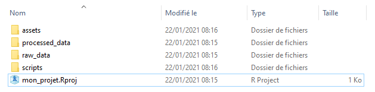
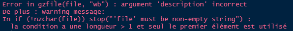
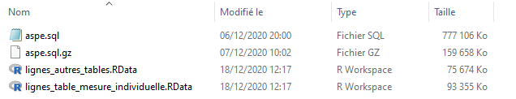

```{r, include = FALSE}
knitr::opts_chunk$set(
  collapse = TRUE,
  comment = "#>"
)
```

# Objet de la présentation

Le présent document vise à présenter comment importer les tables de la base ASPE sous la forme de `dataframe` R. Par la suite, il sera complété d'autres tutos sur l'utilisation des tables.

Le point de départ est un `dump`, sauvegarde de la base qui est réalisée chaque nuit au BRGM qui héberge la base de production. Il est prévu qu'un de ces `dump` soit mis à disposition à fréquence hebdomadaire pour être téléchargeable par les utilisateurs.

# Préparation du projet

De manière générale il est recommandé de travailler sous la forme de "projets R". L'intérêt et la méthode sont développés dans les [supports de formation à R produits par le MTES](https://mtes-mct.github.io/parcours_r_socle_preparation_des_donnees/bien-commencer.html#cr%C3%A9er-un-projet-sous-rstudio-pour-vous-permettre-de-recencer-vos-travaux.).

Pour cet exemple on utilisera une des arborescences classiques :



- Les données brutes sont stockées dans `raw_data`.   
- Les sorties des traitements, y compris intermédiaires, sont dans `processed_data`.
- Les éléments d'illustration (logo, images, etc.) sont dans `assets`.   
- Les scripts sont dans `scripts`.   

... et à a racine on trouve le fichier projet `.Rproj`, sur lequel il convient de cliquer à chaque fois qu'on veut
ouvrir une session de ce projet.


# Activation du package `{aspe}`

... et des autres qui sont nécessaires pour exécuter les scripts.

```{r setup, message = FALSE, warning = FALSE}
library(aspe)
library(tidyverse)
```

# Comment importer la base ?

Si l'on n'a pas la RAM suffisante il faut scinder la base en deux parties qui vont correspondre à 

- la table mesure_individuelle (à elle seule elle représente plus de la moitié du volume)
- toutes les autres tables.

Chacun de ces éléments est stocké dans un fichier au format `.RData`, par défaut dans le répertoire où se trouve le `dump`. Ce découpage prend 5-10'.

>NB : Cette opération peut être bloquée si le chemin d'accès est trop long, ce qui retourne un message d'erreur :



Dans ce cas, déplacez le `dump` pour accourcir le chemin d'accès.

## Cas 1 : votre machine a 16Go de RAM ou plus

On importe la totalité de la base en une fois, ce qui est bien pratique. Dans la logique de l'arborescence du projet, le fichier de données - ici au format compressé archive `.gz` - est stocké dans le répertoire `raw_data`.

Cette opération prend une dizaine de minutes. Quand elle est terminée, des `Warning` sont affichés dans la console, mais pas d'erreurs. Une centaine de `dataframe` apparaissent dans l'objet "Environnement" de RStudio.

```{r, eval = FALSE}
importer_dump_sql(fichier_dump = "raw_data/aspe.sql.gz")
```

>NB : La fonction `importer_dump_sql()` accepte en entrée aussi bien le fichier compressé que décompressé.

## Cas 2 : votre machine a moins de 16Go de RAM

Avec une machine moins performante, la mémoire ne permettra pas de stocker simultanément le gros fichier texte du `dump` et les `dataframes`. Il faudra procéder en deux étapes. Une des tables, nommée `mesure_individuelle`, comprend à elle seule plus de lignes que la totalité des autres qui sont plus d'une centaine. Il s'agit de la traiter à part.

La première étape est de scinder le `dump` en deux parties qui seront stockées en format `.RData` :

- Le premier fichier contient les lignes du *dump* correspondant à la table `mesure_individuelle`.
- Le second contient le reste des lignes.

```{r, eval = FALSE}
scinder_dump(fichier_dump = "raw_data/aspe.sql")
```

Si ça a bien fonctionné on trouve dans le répertoire de destination (par défaut celui où se trouve le fichier du `dump`) les deux fichiers `.RData`.



Ensuite, si l'on connaît les noms des tables dont on aura besoin, on les charge directement au moyen de l'argument `tables_a_extraire` en indiquant leur nom sous forme de vecteur .

```{r, eval = FALSE}
importer_tables_a_partir_des_lignes(lignes_dump = lignes_autres_tables,
                                    tables_a_extraire = c("station", "facies"))
```


Ensuite,on peut charger la partie du `dump` correspondant à toutes les tables sauf la plus volumineuse.

```{r, eval = FALSE}
importer_tables_a_partir_des_lignes(lignes_dump = "raw_data/lignes_autres_tables.RData")
```


# Sinon, on importe tout (environ 5') puis on fera le tri.
importer_tables_a_partir_des_lignes(lignes_dump = lignes_autres_tables)
rm(lignes_autres_tables)
save.image(file = "processed_data/tables_dump_2021_02_11.RData")
