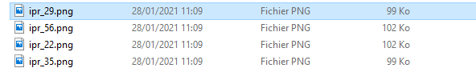

```{r setup, include = FALSE}
knitr::opts_chunk$set(echo = TRUE, warning = FALSE, message = FALSE)
```

# Objectif

Ce document donne un exemple de chaîne de traitement des données Aspe pour présenter des IPR sur une région et effectuer des vérifications au moyen de l'ancienne macro Excel de calcul de cet indice.

Il suppose que les opérations d'importation depuis le `dump` ont été effectuées et les `dataframe` sauvegardés au format `.RData`, comme détaillé dans le [tuto dédié](https://rpubs.com/kamoke/713407).

Les fonctions du package `aspe` dédiées à ces traitements sont identifiées par le préfixe `ipr_`.

# Chargement des packages et des données

```{r, eval = FALSE}
library(aspe)
library(tidyverse)

load(file = "processed_data/toutes_tables_aspe_sauf_mei.RData")
```

```{r, eval = TRUE, echo = FALSE}
library(aspe)
library(tidyverse)

load(file = "../processed_data/toutes_tables_aspe_sauf_mei.RData")
```

# Grandes lignes de l'analyse

## Structure de la base

La base Aspe comprend plus d'une centaine de tables dont la plupart contiennent des référentiels associant des codes à des modalités. Par exemple la table `ref_protocole` associe le code `pro_id` à la modalité *"Pêche partielle par points (grand milieu)"*. Ces tables sont dites "périphériques".

Chaque table comprend une clé primaire (suffixe "_id"), identifiant unique de chacune de ses lignes.

Les tables qui constituent la colonne vertébrale de la base sont au nombre de six :

- station
- point_prelevement
- operation
- prelevement_elementaire
- lot_poissons
- mesure_individuelle

Ces tables sont liées de manières hiérarchique. Ainsi, chaque mesure individuelle se rapporte à un lot, qui se rapporte à un prélèvement élémentaire, qui se rapporte à une opération ... jusqu'à la station.

Pour savoir sur quelle station a été capturé ce goujon de 87mm, il faut donc remonter toute la chaîne.

## Principe

Pour simplifier les différents traitements et éviter d'avoir à reproduire à chaque requête de sélection toute la chaîne de liaison des tables de la colonne vertébrale, on peut construire un tableau de correspondance des clés primaires. On n'incluera toutefois pas la table mesure_individuelle car elle comprend des millions de lignes, ce qui alourdirait considérablement le tableau. Le traitement des mesures individuelles sera abordé ultérieurement. Pour la suite, ce tableau de correspondance sera nommé "passerelle" en ce qu'il fait la jonction entre les différentes composantes de la base.


```{r}
passerelle <- mef_creer_passerelle()
names(passerelle)
```

Comme cette table est assez importante (`r nrow(passerelle)` lignes) il est utile de la restreindre au périmètre qui nous intéresse. Ici, nous allons effectuer une sélection sur le département (codé par les deux premiers chiffres du code Insee de la commune) au moyen de la fonction `mef_select_dept()`.


```{r}
passerelle <- passerelle %>% 
  mef_select_dept(dept = c(22, 29, 35, 56))
```

>Le package {aspe} permet aussi effectuer une [sélection géographique](https://rpubs.com/kamoke/716322), par exemple sur la base des contours d'un bassin. Dans ce cas, on utilise un polygone pour faire la sélection (ne sont conservées que les observations à l'intérieur).

On peut aussi sélectionner uniquement les opérations réalisées dans le cadre des réseaux, ici RCS, RHP et RRP.

Les identifiants correspondant à chacun des réseaux se trouvent dans le champ `obj_id` de la table `ref_objectif`.

```{r}
ref_objectif %>% 
  select(obj_id, obj_libelle) %>% 
  arrange(obj_id) %>% 
  knitr::kable(align = c('c', 'l'))
```


```{r}
passerelle <- passerelle %>%
  mef_select_obj(objectif = c(3, 6, 4))
```

# Bilan des IPR par station

On va utiliser la passerelle pour assurer le lien entre des informations contenues dans différentes tables.

```{r}
date_debut <- '01-01-2010'

ipr <- ipr_extraire(passerelle = passerelle,
                    date_debut = '01/01/2010',
                    date_fin = '31/12/2020')
```

Les premières lignes de ce tableau sont les suivantes :

```{r}
ipr %>% head() %>% DT::datatable()
```

Si l'on veut les mêmes données mais avec une colonne par année :

```{r}
ipr_1c_par_an <- ipr_pivoter_1colonne_par_an(ipr_df = ipr) %>% 
  select(-libelle_point)
```

Les noms des colonnes sont alors :

```{r}
names(ipr_1c_par_an)
```


Pour exporter le tableau en format utilisable simplement avec Excel :

```{r, eval = FALSE}
write.csv2(ipr_1c_par_an, file = "processed_data/ipr_bzh_pdl_large.csv",
           row.names = FALSE, na = "")
```

# Mise en forme pour la macro Excel de calcul de l'IPR

Les notes IPR présentes dans la table `operation_ipr` de la base ASPE sont calculées par le SEEE. Auparavant, ce calcul était effectué par une macro Excel qui prenait en entrée les caractéristiques de la station, la surface pêchée et les captures par espèce. En sortie elle fournissait les 7 métriques et l'indice agrégé.

>NB Les noms des colonnes sont importés depuis le fichier contenant la macro Excel, nommé dans cet exemple `"MacroIPR_Sortie.xlsx"` et contenu dans le sous-répertoire `raw_data`.

Première étape : structuration du tableau.

```{r, eval = TRUE}
data <- ipr_formater_pour_macro(passerelle = passerelle,
                            date_debut = '01/01/2020')
names(data)
```

Seconde étape : Sélection et renommage des variables.

```{r, eval = FALSE, echo = TRUE}
data <- ipr_renommer_pour_macro(data = data, fichier_macro = "raw_data/MacroIPR_Sortie.xlsx")
names(data)
```

```{r, eval = TRUE, echo = FALSE}
data <- ipr_renommer_pour_macro(data = data, fichier_macro = "../raw_data/MacroIPR_Sortie.xlsx")
names(data)
```

Exportation du tableau mis en forme.

```{r, eval = FALSE}
write.csv2(data, "processed_data/aspe_format_macro.csv",
           row.names = FALSE,
           na = "")

```

# Quelques mises en forme

## Evolution par station dans un département

Définition du département.

```{r, fig.width = 10, fig.height = 14}
mon_dept <- '45'
```

Création du sous-jeu de données filtré pour le graphique.

```{r, fig.width = 10, fig.height = 14}
ipr_dept <- ipr %>%
  filter(dept == mon_dept) %>% 
  mef_filtrer_sta_annee(premiere_annee = 2010) %>% 
  mef_filtrer_nb_mini_annees(nb_mini_annees = 5)

ipr_dept %>% head() %>% DT::datatable()
```

Pour produire le graphique "en treillis" sur un jeu de stations, la fonction `ipr_grapher_plusieurs_stations()` offre la possibilité de :

- filtrer les données pour préciser la période (arguments `premiere_annee` et `derniere_annee`) et les identifiants des stations (`stations_id`)
- filtrer les stations pour ne retenir que celles avec suffisamment d'années de données (`nb_mini_annees`)
- ajouter un titre au graphique (`titre`)
- modifier la mise en forme du graphique en fixant une limite supérieure à l'axe des ordonnées (IPR) pour éviter qu'une observation extrême nuise à la lisibilité de l'ensemble (`max_axe_y`), en choisissant le nombre de colonnes de graphiques (`nb_colonnes`) et choisissant une palette de couleurs à associer aux modalités des classes d'IPR


```{r, fig.width = 10, fig.height = 14}
mon_graphique <- ipr_grapher_plusieurs_stations(ipr_df = ipr_dept,
                                                titre = mon_dept,
                                                max_axe_y = 40)
mon_graphique # affichage à l'écran
```

Si l'on veut sauvegarder le graphique (ici dans le sous-répertoire `"processed_data"`), il faut utiliser la fonction `ggsave()` Le choix de l'extension choisie ("png", "jpg", ".bmp") détermine le format de sortie.

Le graphique de sortie étant un un objet de classe `ggplot`, il peut être modifié par certaines des fonctions de ce `package`. Par exemple, les différences mineures entre l'affichage à l'écran et la sauvegarde font que la taille de police n'est pas toujours bien adaptée au format d'export. Dans ce cas, on peut modifier la taille de certains éléments texte comme ici le nom de la station :

```{r}
mon_graphique <- mon_graphique +
  theme(strip.text.x = element_text(size = 7))
```

>NB la synthaxe du package `ggplot2` utilise pour enchaîner les manipulations l'opérateur `+` au lieu du ` %>%` ailleurs ...

Chemin de sauvegarde et nommage du fichier (concaténation avec la fonction `paste0()`) :

```{r, eval = TRUE}
mon_chemin <- paste0("processed_data/ipr_", mon_dept, ".png")
mon_chemin
```

Sauvegarde :

```{r, eval = FALSE}
ggsave(filename = mon_chemin,
       plot = mon_graphique,
       width = 15, # largeur
       height = 25, # hauteur
       units = 'cm') # unité.
```

Pour automatiser la production des graphiques sur un ensemble de départements, on peut utiliser les fonctions de la famille `map` du package `purrr` afin d'appliquer les fonctions non plus à chaque fois sur un objet (ex : le nom du département ou le graphique) mais sur une liste contenant plusieurs objets (ex : les noms des départements ou les graphiques).

```{r}
mes_depts <- c('35', '22', '56', '29')

depts_libelles <- departement %>%
  filter(dep_code_insee %in% mes_depts) %>%
  pull(dep_libelle) %>% 
  as.character()

depts_libelles
```

Filtrage du jeu de données aux départements concernés, à partir de 2010 et en excluant les stations avec moins de 5 années de données.

```{r}
data <- ipr %>%
  filter(dept %in% mes_depts) %>% 
  mef_filtrer_sta_annee(premiere_annee = 2010) %>% 
  mef_filtrer_nb_mini_annees(nb_mini_annees = 5)
```

On scinde le tableau pour en avoir un par département. L'objet `data_par_dept` est une liste contenant un `dataframe` par département.

```{r}
data_par_dept <- split(data, data$dept)
```

Production des graphiques. La fonction `map2()` prend en arguments la fonction à appliquer ainsi que deux listes contenant les arguments de la fonction :

- Fonction à appliquer : `.f = ipr_grapher_plusieurs_stations`
- Première liste, celle des `dataframe` : `.x = data_par_dept`
- Seconde liste, celle des titres des graphiques : `.y = depts_libelles`

```{r}
mes_graphiques <- map2(.x = data_par_dept,
                       .y = depts_libelles,
                       .f = ipr_grapher_plusieurs_stations)
```

L'objet `mes_graphiques` est une liste contenant autant d'éléments qu'il y a de graphiques, soit un par département. Pour accéder au x^ième^ de ces graphiques on le sélectionne dans la liste au moyen de `[[x]]`

```{r, eval = FALSE}
mes_graphiques[[3]]
```

Pour sauvegarder ces graphiques, on poursuit avec les fonctions `map()` quand on a une seule liste d'arguments à appliquer à la fonction et `map2()` quand il y en a deux.

```{r, eval = FALSE}
# mise des polices à l'échelle
mes_graphiques <- map(.x = mes_graphiques,
                      .f = function(x) {x + theme(strip.text.x = element_text(size = 7))})

# construction des chemins et noms de fichiers
mes_chemins <- paste0("processed_data/ipr_", mes_depts, ".png")
mes_chemins

# sauvegarde
map2(.x = mes_chemins,
     .y = mes_graphiques,
     .f = ggsave,
     width = 16, # largeur
     height = 25, # hauteur
     units = 'cm')
```

Comme tout se déroule à merveille, vous pouvez vérifier la présence des fichiers image sauvegardés dans le sous-répertoire de sortie.



## Pourcentage de stations en bon état

```{r}
ipr_grapher_pc_bon(ipr_dept, titre = "22") +
  labs(x = "")
```


# Analyse par métrique

## Principe

Il faut dans un premier temps collecter les données non seulement de l'indice agrégé mais de chacune de ses sept métriques. On peut s'intéresser aux valeurs des métriques elles-mêmes, mais aussi aux valeurs prédites par les modèles sous-jacents.

Ci-dessus, un `dataframe` passerelle a déjà été constitué pour effectuer les liens entre tables. Il est nécessaire de le filtrer pour ne conserver que les stations qui nous intéressent.

## Assemblage du `dataframe`

Création d'un vecteur contenant les identifiants des opérations.

```{r}
mes_operations <- ipr_dept %>% 
  pull(ope_id)
```

Préparation du `dataframe` en repartant de la passerelle.

```{r}
ipr_metriques <- passerelle %>% 
  select(-pre_id, -lop_id) %>% # variables inutiles
  distinct() %>% # suppression des lignes dupliquées
  mef_ajouter_ope_date() %>% # ajout date et année
  mef_filtrer_sta_annee(premiere_annee = 2010) %>% # filtrage sur l'année
  filter(ope_id %in% mes_operations) %>% # filtrage sur les identifiants d'opérations ope_id
  ipr_extraire_metriques() # ajout des métriques
```

Les noms des colonnes du tableau sont les suivants :

```{r}
names(ipr_metriques)
```

.
.
.
.

## Représentations graphiques sur une station

### Préparation des éléments nécessaires

**Identifiant de station**

Il n'est pas entre guillements car cle champ `sta_id` est numérique dans les tables.

```{r}
mon_id_station <- 10708
```

Création d'un extrait du `dataframe` général avec uniquement notre station.

```{r}
data_sta <- ipr_metriques %>%
  filter(sta_id == mon_id_station) %>% 
  mutate(annee_car = as.character(annee)) %>% 
  column_to_rownames(var = "annee_car")
```

**Titre du graphique**

```{r}
mon_titre <- data_sta %>% 
  slice(1) %>% 
  pull(sta_libelle_sandre)
```

**Palette de couleur**

Le *package* `{RColorBrewer}` propose des palettes de couleurs "standard" contrastées ou dégradées. Chaque couleur est identifiée par un code hexadécimal. Par exemple en utilisant [un générateur en ligne](https://htmlcolorcodes.com/fr/) on obtient la correspondance entre la vouleur et son code.


Ici nous utilisons la palette dégradée allant du rouge au bleu via le jaune `"RdYlBu"`. Il faut une couleur par contour (= par année représentée) donc autant de couleurs que d'années.

```{r}
nb_annees <- nrow(data_sta)

# Vecteurs des couleurs de ligne
couleurs_traits <- RColorBrewer::brewer.pal(n = nb_annees, name = "RdYlBu")
couleurs_traits
```

On peut ensuite définir utiliser le package `{GISTools}` pour définir la palette pour les remplissages qui est simplement la même que celle des traits, mais avec de la transparence.

```{r}
couleurs_remplissage <- couleurs_traits %>%
  GISTools::add.alpha(alpha = 0.1)
```

### Mise en forme du tableau

La représentation graphique en radar va faire appel au *package* `{fmsb}` qui nécessite une mise en forme assez spécifique des données.

```{r}
data_sta <- ipr_mef_radar (metriques_df = ipr_metriques,
                station_id = 10708)

library(fmsb)
```

Le tableau mis en forme ne contient comme colonnes que les métriques. Les lignes ont été nommées d'après les années. Deux lignes ont été insérées en haut du tableau, qui servent à préciser les bornes (mini et maxi) pour chacune des métriques. Avec la fonction `ipr_mef_radar()` le mini est fixé à zéro et le maxi est la valeur la plus élevée de l'ensemble des métriques pour l'ensemble des années.

```{r}
knitr::kable(data_sta, row.names = TRUE)
```

### Graphique en radar

Le graphique est produit par la fonction `radarchart` du package `fmsb` qui admet de très nombreux arguments permettant de personnaliser l'aspect des axes et de leurs graduations, des étiquettes, etc. Pour avoir accéder à l'aide de la fonction :

```{r, eval = FALSE}
?radarchart
```


Malheureusement cette aide est très sommaire et manque d'exemples.

```{r, fig.height = 8, fig.width = 6.5}

radarchart(data_sta,
           axistype = 2, 
           #custom polygon
           pcol = couleurs_traits, pfcol = couleurs_remplissage, plwd = 4, plty = 1,
           #custom the grid
           cglcol = "grey", cglty = 1, axislabcol = "grey20",
           #custom labels
           vlcex = 0.8,
           title = mon_titre)

legend(x = 0.7, y = 1.55,
       legend = rownames(data_sta[-c(1,2),]),
       bty = "n", pch = 20 ,
       col = couleurs_traits,
       text.col = "grey80", cex = 1.2, pt.cex = 3)
```

**Diagramme en bâtons**

```{r}
data_sta2 <- data_sta %>% 
  slice(-(1:2)) %>% 
  rownames_to_column(var = "annee") %>% 
  mutate(annee = as.integer(annee)) %>% 
  pivot_longer(cols = -annee, names_to = "metrique", values_to = "valeur")

ggplot(data = data_sta2, aes(x = annee, y = valeur)) +
  geom_bar(stat = "identity", fill = couleurs_traits[1]) +
  labs(x = "", y = "Valeur de la métrique", title = mon_titre) +
  facet_wrap(~metrique)
```


